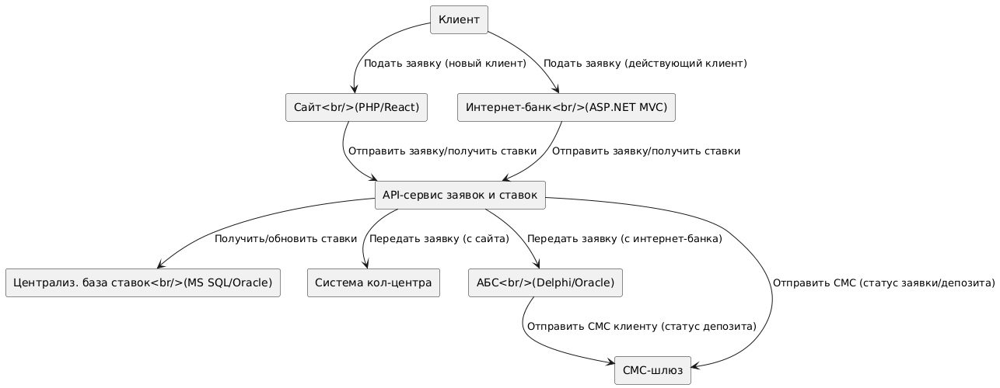
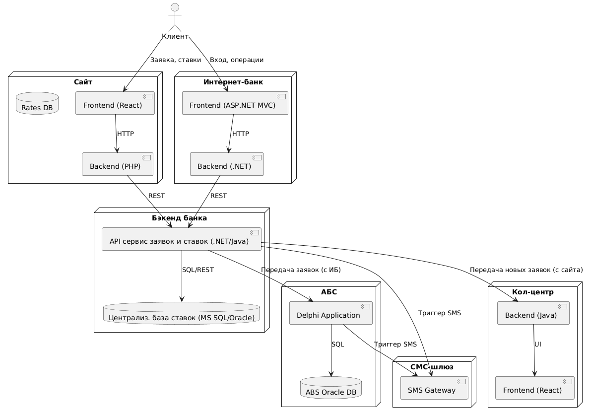

###  Название задачи: Проектирование архитектуры MVP онлайн-сервиса открытия депозитов
###  Автор: Панчук Филипп
###   Дата: 06.07.2025

### **Функциональные требования**
| № | Действующие лица или системы         | Use Case                         | Описание                                                                                             |
|---|--------------------------------------|----------------------------------|------------------------------------------------------------------------------------------------------|
| 1 | Клиент (новый), Сайт                 | Подача заявки на депозит         | Клиент заполняет ФИО и телефон, выбирает депозит — заявка отправляется в бэкенд, после чего происходит звонок из кол-центра |
| 2 | Клиент (действующий), Интернет-банк   | Подача заявки на депозит         | Клиент выбирает депозит, вводит сумму, выбирает счет, подтверждает по СМС — заявка отправляется в АБС, заявка обрабатывается бэк-офисом |
| 3 | Бэк-офис депозиты, АБС               | Рассмотрение и подтверждение заявки | Менеджер обрабатывает заявку, подтверждает условия, инициирует открытие депозита и отправку СМС     |
| 4 | Кол-центр, Система кол-центра         | Контакт с клиентом по заявке с сайта | Менеджер кол-центра связывается с клиентом и договаривается о визите в отделение для идентификации и открытия вклада |
| 5 | Система сайта, Система интернет-банка, АБС | Отображение актуальных ставок    | Системы получают актуальные ставки через централизованный сервис или из общей БД — отображают на UI |
| 6 | Клиент, СМС-шлюз, Интернет-банк/АБС   | Подтверждение/уведомление по СМС | После одобрения/открытия депозита клиенту отправляется СМС через внешний шлюз                     |
### **Нефункциональные требования**

| №  | Требование                                                                 |
|----|----------------------------------------------------------------------------|
| 1  | Все внешние и внутренние каналы — только по защищенным протоколам (HTTPS, TLS) |
| 2  | Сервисы интернет-банка должны быть доступны 99,9% времени                   |
| 3  | Архитектура — с поддержкой горизонтального масштабирования (интернет-банк, сайт) |
| 4  | Отказоустойчивость: работа в двух дата-центрах (при сбое — переключение на резервную площадку) |
| 5  | Отклик по операциям — миллисекунды-на секунды, оптимальное время загрузки UI |
| 6  | Ставки по депозитам хранятся централизовано, доступ к ним у обеих команд бэк-офиса |
| 7  | Используются технологии, в которых есть экспертиза у банка (MS SQL, Oracle, .NET/Delphi/Java) |
| 8  | Не допускается прямая интеграция интернет-банка с АБС                        |
| 9  | Все пользовательские данные надежно сохраняются и защищены                  |
| 10 | Фронт-энд соответствует корпоративной дизайн-системе                        |
| 11 | Не изменять ядро интернет-банка                                            |
| 12 | MVP позволяет масштабирование под будущие микросервисы и очереди            |
### **Решение**
## Диаграмма контекста 

## Диаграмма контейнеров

- Сайт и интернет-банк работают через REST API/небольшой единый backend microservice для заявок и ставок.
- Сервис ставок — централизованный источник данных (MS SQL или Oracle), куда заносят ставки бэк-офисы.
- Кол-центр получает заявки с сайта через интеграцию с REST API.
- АБС обрабатывает заявки только после ручного подтверждения бэк-офисом, получает информацию о ставках также через централизованную БД/сервис.
- СМС-уведомления инициируются из интернет-банка/АБС через имеющийся шлюз.
- Также опишите, какой логикой вы руководствовались в ходе принятия решений и выбора технологий. Не забывайте, что необходимо учесть все функциональные и нефункциональные требования.

### **Альтернативы**
- **Вариант 1**: Организовать сервис обработки заявок на базе отдельного микросервиса с очередями (например, RabbitMQ/Kafka). Минус: выше затратность и сложнее для MVP.
- **Вариант 2**: Хранить ставки как сейчас (XLS-файлы и прямое обновление на разных системах). Минус: высокая вероятность ошибок и несогласованности ставок.

**Недостатки, ограничения, риски**
- Централизация ставок — новый процесс, потребуется синхронизация между бэк-офисами и изменение привычной практики.
- Если промежуточный сервис/API ляжет, заявки не будут доставляться в АБС/кол-центр.
- В MVP остаётся "человеческий" фактор: ручная обработка заявок бэк-офисом → риск ошибочных одобрений/отказов.
- Ограничение масштабируемости со стороны АБС (vertical only).
- Возможная необходимость дополнительных интеграционных тестов между API и legacy-системами.

